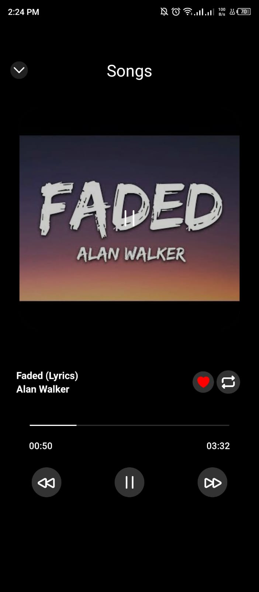
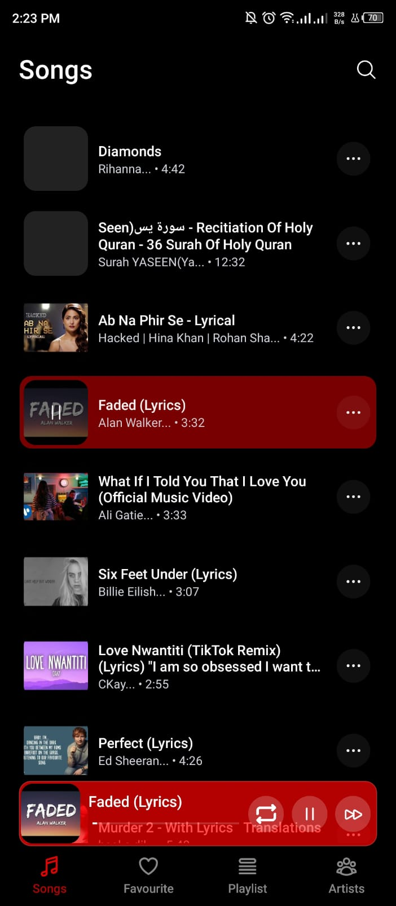
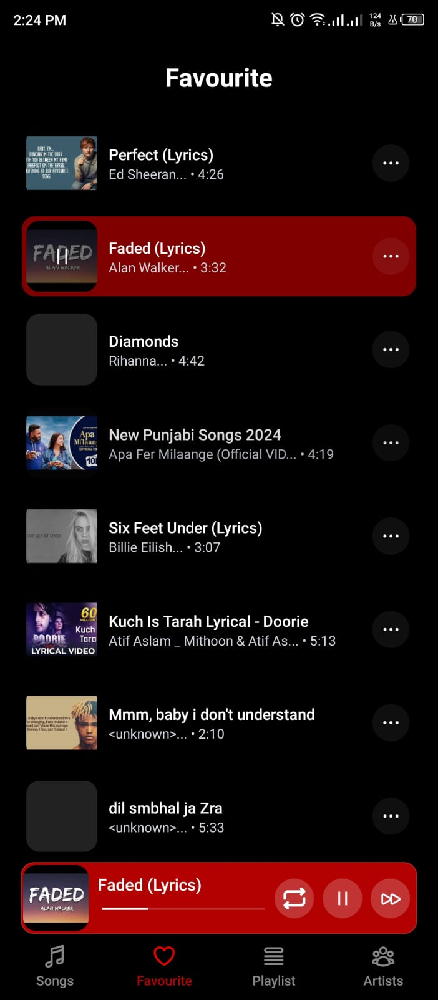
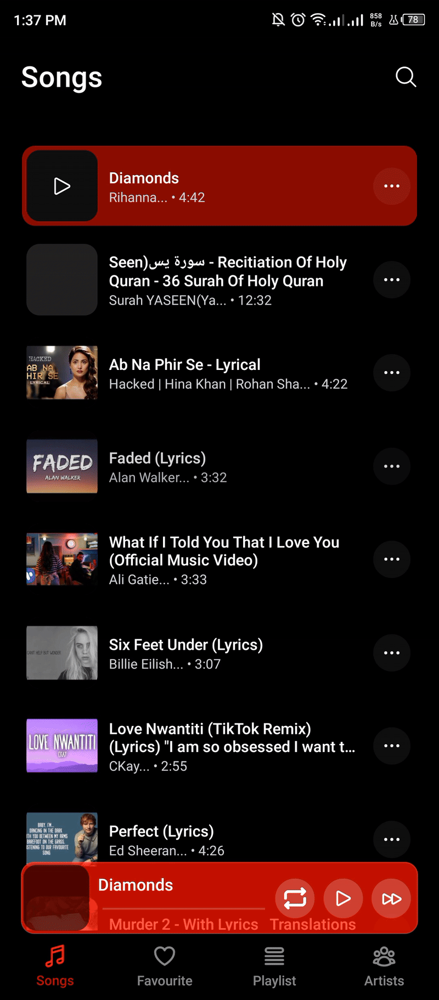

# 🎵 React Native Music Player

A modern, high-performance **offline music player** built with **React Native**, designed to read and play local audio files seamlessly.  
It features background playback, queue management, liked songs, artists view, playlists, and smooth animations — delivering a clean and fast music experience.

---

## 🚀 Features

### 🎶 Core Player
- Plays **local device audio files** (MP3, WAV, etc.)
- Full **playback control** — Play / Pause / Next / Previous / Seek
- **Play in queue** — automatically plays next song
- **Shuffle & Repeat** support (optional)
- **Background playback** (continue playing when app is minimized)
- **Lock screen & notification controls** (via Track Player)
- Smooth **audio transition and progress bar** animation

### 💾 Library Management
- Automatically scans and lists all audio files on device
- Organized by **Artists**, **Albums**, and **Playlists**
- Supports **searching** and **sorting**

### ❤️ Favorites & Playlist
- Like/Unlike songs
- Create and manage custom playlists
- Quickly access favorite tracks

### ⚙️ Technical Highlights
- Built using **React Native** + **TypeScript**
- **react-native-track-player** for background audio & queue control
- **MMKV** for ultra-fast persistent storage
- **FlashList** for high-performance large list rendering
- Optimized queue loading and track skipping
- Minimal **APK size** & memory footprint

---

## 📱 Screenshots

| Player Screen | Song List | Favorites |
|----------------|------------|------------|
|  |  |  |

> (Replace above image paths with your actual screenshots)

---

## 🎬 Demo Video

[]
> 🎥 Click above to see the app in action

---

## 🧠 Architecture

- **`react-native-track-player`** → Core music engine (queue, background control)
- **`react-native-mmkv`** → Store liked songs & playlists
- **`react-navigation`** → Smooth navigation between player and library
- **`FlashList`** → High-performance music list rendering
- **`react-native-bootsplash`** → Custom splash animation
- **`heroicons`** → Beautiful, minimal icons

---

## 🛠️ Installation

Clone the repository:
```bash
git clone https://github.com/yourusername/react-native-music-player.git
cd react-native-music-player
